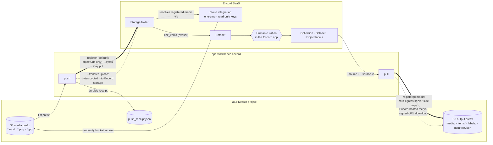

# Encord: push data for curation, pull curated data back

[Encord](https://encord.com/) is a data curation and annotation platform. The
Workbench integration is a round trip your data makes around a human curation
step:

1. **`npa workbench encord push`** — your S3 media becomes an Encord dataset.
   In the default *register* mode the bytes never leave your bucket; Encord
   references them through a cloud integration you create once. An *upload*
   mode copies the bytes into Encord-hosted storage instead.
2. **You curate in the Encord app** — filter, review, build a Collection, or
   annotate in a Project.
3. **`npa workbench encord pull`** — the curated Collection, Dataset, or a
   Project's labels come back to S3 as media + per-item JSON + a lineage
   manifest that downstream stages consume.

> **TL;DR:** create an Encord API key and an S3-compatible integration (both
> one-time, in the Encord app), point `~/.npa/credentials.yaml` at the key,
> run `npa workbench health preflight --checks encord`, then `push` → curate →
> `pull`.

## File-format support in this integration

This table describes the formats supported by **NPA's Encord integration**, not
every format Encord itself can store or annotate.

| Data | NPA Encord support | Details |
|---|---|---|
| Video | Supported: `.mp4` | `push` registers or uploads it; `pull` materializes it. The Cosmos augmentation workflow requires video. |
| Images | Supported: `.png`, `.jpg`, `.jpeg` | `push` registers or uploads individual images; `pull` materializes them. |
| MCAP / LiDAR / point clouds | Not supported | Encord supports scene and point-cloud modalities, including `.mcap`, but this integration does not yet construct the required per-stream scene payload. `--media mcap` or `--media all` records each MCAP as `experimental_error` and fails closed. |
| ROS bags / other sensor data | Not supported | No scene, calibration, timestamp, or multi-stream ingestion path is implemented. |
| Composite Encord items | Pull not supported | Image groups and DICOM series have no single signed URL, so pull records a per-item error. |

Do not use an unsupported suffix as a generic file transport. The tool skips
unknown formats by default so a successful receipt always means the registered
items used a supported ingestion path.

## The integration at a glance



Solid heavy arrows are the default register-mode paths; dashed arrows are the
upload-mode variants. Both `push` and `pull` authenticate with your Encord API
key (`ENCORD_SSH_KEY*`); the cloud integration is a separate, Encord-side
credential that only ever grants *read* on the media bucket. The receipt and
manifest are written before any failure exit, so lineage survives fail-closed
runs.

## One-time setup

### 1. Create an Encord API key

1. In the Encord app go to **Settings → Public keys → New key**.
2. Download the generated **private key** file (an Ed25519 PEM, a few hundred
   bytes) and keep it somewhere private, e.g. `~/.ssh/encord-private-key.ed25519`.

### 2. Create the S3-compatible cloud integration (register mode)

Register mode needs Encord to be able to *read* your bucket. In the Encord app
create an integration following Encord's **MinIO / S3-compatible** pattern:

- **Endpoint**: your Nebius storage endpoint, `https://storage.<region>.nebius.cloud`
  (the `s3 endpoint` line of `npa configure --show`).
- **Access key pair**: a key pair with **read** access to the media bucket. A
  dedicated read-only pair is best practice.
- Prefer **strict client-only access** so Encord signs URLs client-side rather
  than copying media server-side. If the Encord viewer will load media directly
  in your browser, add a bucket CORS rule allowing `*.encord.com`.

Note the integration's **title** (for example `nebius-s3`) — the CLI takes it
directly; you never need to copy UUIDs. Upload mode needs no integration.

### 3. Point npa at the key

Add the key **file path** to `~/.npa/credentials.yaml` (the least error-prone
option — pasting multi-line PEMs into YAML is easy to truncate):

```yaml
tokens:
  ENCORD_SSH_KEY_FILE: /Users/<you>/.ssh/encord-private-key.ed25519
```

Alternatives that also work:

- `ENCORD_SSH_KEY` with the full PEM as a YAML literal block (`|`),
- `ENCORD_SSH_KEY_B64` with the base64 of the PEM — this is also the form you
  forward into workflow pods (see below):

  ```bash
  base64 < ~/.ssh/encord-private-key.ed25519 | tr -d '\n'
  ```

US-hosted Encord orgs: also `export ENCORD_DOMAIN=https://api.us.encord.com`.

### 4. Verify before doing anything else

```bash
npa workbench health preflight --checks encord
```

`PASS ... Encord authenticated` means the key parses and the API accepts it.
This gate catches a truncated key paste or an unregistered key in seconds
instead of mid-push.

## Push: S3 → Encord

```bash
npa workbench encord push \
  --input-path s3://<bucket>/raw-media/ \
  --integration nebius-s3 \
  --folder my-batch --dataset my-batch \
  --output-path s3://<bucket>/encord/push/
```

- Discovers `.mp4`, `.png`, `.jpg`/`.jpeg` under the prefix (`--media` filters).
  MCAP is visible only through the experimental `--media mcap|all` filters and
  is deliberately recorded as an error; see the support table above.
- `--folder`/`--dataset` accept a title or id; unique titles are created when
  absent, so a fresh batch needs no clicking around first.
- Items are registered in place and **explicitly linked** into the dataset.
- `--transfer upload` copies bytes into Encord-hosted storage instead
  (no integration needed).
- A durable receipt (`push_receipt.json`, `npa.encord.push_receipt.v1`) records
  every file, its Encord item uuid, and per-file errors. The receipt is written
  **before** any failure exit, and any unit error fails the command closed. If a step throws after Encord was mutated, the receipt still lands with the exception recorded in its `error` field.
- In register mode, re-pushing the same prefix is idempotent: duplicates are
  skipped (`skip_duplicate_urls`) and already-registered items are re-linked
  into the dataset. Upload mode creates new copies on re-push.

## Curate in the Encord app

Work exactly as you normally do. When you're done, the pull source is one of:

| You curated with… | Pull with |
|---|---|
| A **Collection** (Index/Curate) | `--source collection --source-id <uuid-or-name>` |
| The **Dataset** itself (deleting bad items) | `--source dataset --source-id <hash-or-title>` |
| An Annotate **Project** (labels) | `--source project --source-id <hash-or-title>` |

## Pull: Encord → S3

```bash
npa workbench encord pull \
  --source collection --source-id keepers \
  --output-path s3://<bucket>/encord/pull/
```

Output layout under `--output-path`:

```text
media/<item_uuid>__<name>     # the curated media files
items/<item_uuid>.json        # per-item Encord metadata
labels/<label_hash>.json      # project source only (LabelRowV2 JSON)
manifest.json                 # npa.encord.pull_manifest.v1 lineage + counts
```

Media registered from your own bucket returns as **zero-egress server-side
copies**; Encord-hosted (uploaded) media streams back through signed URLs. The
manifest is written before any failure exit; any failed item fails the command
closed.

## Python SDK

The CLI is a thin wrapper over the same functions:

```python
from npa.sdk.workbench import encord

receipt = encord.push(
    input_path="s3://<bucket>/raw-media/",
    integration="nebius-s3",
    folder="my-batch",
    dataset="my-batch",
    output_path="s3://<bucket>/encord/push/",
)
manifest = encord.pull(
    source="collection",
    source_id="keepers",
    output_path="s3://<bucket>/encord/pull/",
)
```

Both return the Pydantic models (`PushReceipt` / `PullManifest`) that are also
persisted to S3, and raise `EncordToolError` on the same fail-closed conditions
as the CLI.

## Workflows

Three shipped specs wrap the same tool
(`npa/workflows/workbench/npa-workflows/`):

- `encord-push.yaml` — production push, terminal at the receipt (curation is
  human-in-the-loop between workflows).
- `encord-pull.yaml` — production pull, run after curation.
- `encord-cosmos3-augment.yaml` — the curation-to-augmentation loop in one
  run: pull an Encord video, generate two distinct real Cosmos 3 video2video
  variants, and push all results back into Encord as `npa-aug-<run-id>`. **Runs out
  of the box**: the default seeds a run-scoped demo dataset from the packaged
  pinned starter clip (public, CC-BY-4.0, SHA-256-verified) and uploads bytes,
  so only the Encord API key is needed. For your real data pass
  `--var encord_source_id=<your-curated-id>` (seeding no-ops) and, for
  register-in-place, `--var encord_transfer=register
  --var encord_integration=<title>`; `encord_item_index` picks the video.
- `encord-roundtrip-smoke.yaml` — live e2e proof: push fixture media into a
  fresh `npa-e2e-<run-id>` folder + dataset, then pull that dataset straight
  back, no human step. Add `--var encord_transfer=upload` for the
  byte-copy variant.

Forward the credential to pods **by name only** — the base64 form survives the
secret transport:

```bash
export ENCORD_SSH_KEY_B64="$(base64 < ~/.ssh/encord-private-key.ed25519 | tr -d '\n')"
npa workbench workflow submit npa/workflows/workbench/npa-workflows/encord-roundtrip-smoke.yaml \
  --runtime --var bucket=<bucket> --var encord_integration=nebius-s3 \
  --secret-env ENCORD_SSH_KEY_B64 \
  --secret-env AWS_ACCESS_KEY_ID --secret-env AWS_SECRET_ACCESS_KEY
```

(Storing `ENCORD_SSH_KEY_B64` under `tokens:` in `~/.npa/credentials.yaml`
works too — submit resolves secret names from there when they are not in the
environment.)

## Troubleshooting

| Symptom | Cause and fix |
|---|---|
| `Encord authentication failed: Incorrect padding` | The pasted PEM was truncated or its newlines were mangled by YAML. Use `ENCORD_SSH_KEY_FILE` with the downloaded key file instead. |
| Push receipt shows per-file `error` rows (403/404 from Encord) | The integration's access keys cannot read that bucket/prefix, or the endpoint in the integration is wrong. Fix the integration in the Encord app; the receipt names each failing file. |
| `No Encord cloud integration titled '...'` | Title mismatch — the error lists the titles your key can see. |
| `.mcap` files land as `experimental_error` in the receipt | MCAP cloud registration has no supported upload format in the pinned SDK yet; the receipt-visible error is intentional. Push videos/images with the default `--media`. |
| Pull error `item has no signed URL (composite items...)` | Image groups / DICOM series expose no single signed URL and are not supported by pull. |
| US-hosted org, auth fails with a valid key | Set `ENCORD_DOMAIN` (the SDK default is the EU endpoint). |

For the agent-facing summary and validation status see
[skills/tools/encord/SKILL.md](../../skills/tools/encord/SKILL.md); the CLI
reference is generated at [docs/cli/encord.md](../cli/encord.md).
