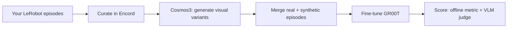
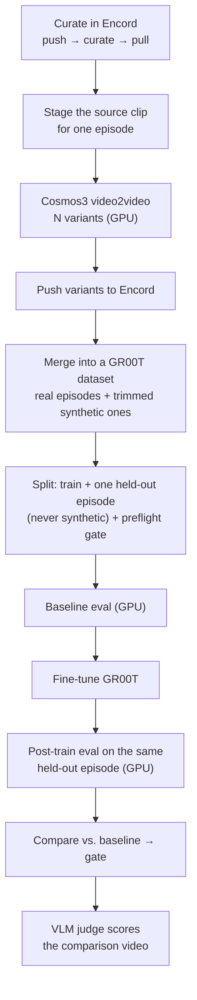
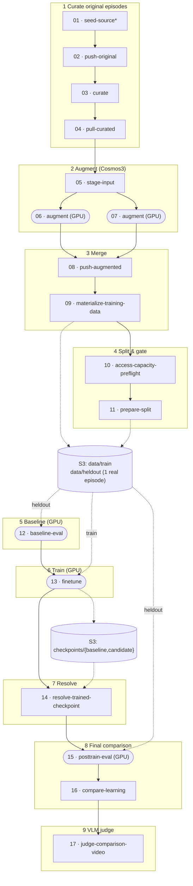

# Fine-tune GR00T on Cosmos-augmented robot demonstrations

You have a handful of robot demonstrations and you want more visual variety
than more teleop time can buy you. This guide takes a LeRobot dataset in your
bucket, curates it in Encord, generates physically-plausible visual variants
of each episode with Cosmos3 video2video, folds the synthetic episodes into
the training set alongside your real ones, fine-tunes GR00T N1.7, and scores
the result with both an offline metric and a VLM judge. One YAML, one submit.

It is written for a robotics engineer who knows their robot and their data but
has not combined synthetic-data generation with policy fine-tuning before.

> **Validation status: augmentation and training proven live; evaluation in
> flight.** Run `cosmos-check-20260909T173508Z` (H100) has completed
> `seed-source` through `baseline-eval` -- the Encord roundtrip on the original
> episodes, two real Cosmos3 video2video generations, the merge into a GR00T
> dataset, and the pre-training baseline -- and `finetune` is running as this
> is written. `resolve-trained-checkpoint` through `judge-comparison-video`
> have not yet published a `learning-report.json`, so this guide states the
> mechanism for those stages without inventing numbers for them. The
> `finetune` / `posttrain-eval` / `compare-learning` tools themselves are
> separately proven at 50-episode scale by the plain fine-tuning run
> `encord-groot-finetune-20260908T222914Z` (skill score +0.910 on a held-out
> cohort read once) -- see [Related](#related) for that guide if you want
> those exact numbers today. Update this banner with the completed run's own
> `reports/learning-report.json` once it publishes.

## What you get, and what you do not

The run ends with two pieces of evidence: an offline number, how much better
the fine-tuned policy predicts a held-out episode's actions than the base
model did, and a VLM's opinion on a rendered video of expert, baseline, and
fine-tuned action traces overlaid on the same held-out frames.

Neither is a success rate. Nothing here closes the loop, so prediction error
and a VLM's read of an overlay say nothing about recovery, timing, or contact
on real hardware. Treat an `improved` outcome as permission to try the policy
under supervision, not as a result about hardware.

This pipeline is also **leaner than a from-scratch dataset-integrity
pipeline**, by design at its current scale: it trains and evaluates on a
single held-out episode with no candidate-checkpoint sweep, and it has no
standalone dataset-audit or Encord-roundtrip-verify stage of its own. It does
guard the one leak that would silently invalidate everything -- see
[Is my data usable?](#is-my-data-usable) -- but if you want the full
three-cohort, five-candidate-checkpoint, audited-and-verified discipline on a
production-scale dataset, run the
[plain fine-tuning guide](encord-groot-finetune.md) either instead
or afterwards, pointed at this pipeline's merged output.

## Before you start

You need a set-up workbench: a Kubernetes context, validated `npa-groot`,
`npa-cosmos3`, and `npa-cosmos` images, and credentials in
`~/.npa/credentials.yaml` for Hugging Face, S3, Encord, Weights & Biases, and
Token Factory (for the VLM judge). You also need an Encord S3-compatible cloud
integration that can read your bucket. See [Encord setup](../encord.md) and,
for a fresh machine, the [platform quickstart](../../quickstart.md).

**This spec lives on branch `claude/nebius-encord-cosmos-pipeline-42e1de`**,
at `npa/workflows/workbench/npa-workflows/encord-cosmos3-groot-finetune.yaml`,
alongside the module that implements the Cosmos-specific stages,
`npa/src/npa/workflows/encord_groot_loop.py`. Check that branch out (or its
merged successor) before you submit; it is not on `main`.

```bash
npa workbench health preflight --checks s3,hf,encord,wandb --json
npa workbench health access --capability groot --json
npa workbench token-factory models
```

The `wandb` check warns rather than fails when the key is absent. `token-factory
models` matters here specifically: `judge-comparison-video` defaults to
`google/gemma-3-27b-it`, which is Hugging Face-gated, so a hosted deployment
without that license will need `--var vlm_model=<a currently-hosted vision
model>` -- check what Token Factory actually serves before you get to stage 17.

## Your data

The pipeline takes a **standard LeRobot dataset** in S3, either v3.0 or v2.1,
at `lerobot_dataset_uri`. If that path is empty, `seed-source` populates it
from a public Hugging Face dataset first -- that is how this was validated,
against `lerobot/pusht` at a pinned revision, 3 episodes. Point
`lerobot_dataset_uri` at your own recordings instead and `seed-source` has
nothing to do.

```bash
aws s3 sync ./my-dataset s3://<bucket>/encord-groot/<run-id>/lerobot-source/
```

`lerobot_episode_index` names which episode gets Cosmos-augmented (this spec
augments one episode into `augmentation_count` synthetic variants, not the
whole dataset); `lerobot_heldout_episode_index` names a **different**, real
episode that Cosmos never touches and that scores the fine-tune. Both are
plain zero-based episode indices into your dataset.

## Submit

```bash
npa workbench workflow submit \
  npa/workflows/workbench/npa-workflows/encord-cosmos3-groot-finetune.yaml \
  --run-id <unique-id> --runtime --max-wait-seconds 0 \
  --var bucket=<bucket> \
  --var lerobot_dataset_uri=s3://<bucket>/<prefix>/lerobot-source/ \
  --var lerobot_episode_index=0 --var lerobot_heldout_episode_index=1 \
  --var encord_integration=<your-encord-integration-title> \
  --var gpu_type=H100 --var gpu_count=1 \
  --image-override workbench.groot=<registry>/npa-groot:<tag> \
  --image-override workflow.groot.prepare_dataset=<registry>/npa-groot:<tag> \
  --image-override workflow.groot.validate_checkpoints=<registry>/npa-groot:<tag> \
  --image-override workbench.cosmos3=ghcr.io/nebius/nebius-physical-ai/npa-cosmos3:<tag> \
  --image-override workbench.vlm_eval=ghcr.io/nebius/nebius-physical-ai/npa-cosmos:<tag> \
  --secret-env HF_TOKEN --secret-env ENCORD_SSH_KEY_B64 \
  --secret-env WANDB_API_KEY --secret-env NEBIUS_TOKEN_FACTORY_KEY \
  --stage-src
```

`--max-wait-seconds 0` is not optional, for the same reason as any GPU
fine-tune: the runtime's default one-hour per-wave deadline does not survive a
cold image pull plus a model download plus training.

**Five image-override flags, not three.** This pipeline needs the `npa-groot`
image for its GR00T stages, plus `npa-cosmos3` for `augment` and `npa-cosmos`
for `judge-comparison-video`. Neither Cosmos image is in this cluster's
private registry -- both resolve there with `404`, but both are published
publicly on GHCR, which is where the two `--image-override` lines above point.
`--registry` cannot express this (it appends one pinned tag to every image
name), and a bare `--image` would put every stage, Encord and Cosmos alike, on
whichever single image you name.

Verify the routing before you submit, the same way as the plain guide's
[routing check](encord-groot-finetune.md#submit) -- the `plan-only` probe
script there works unchanged against this spec, just swap in the flags above.

Watch it:

```bash
npa workbench workflow status <run-id> --json
npa workbench workflow logs <run-id> --stage augment
npa workbench workflow logs <run-id> --stage finetune
```

## How long it takes

Measured on the reference run (H100, `augmentation_count=2`, `max_steps=100`,
a 5-episode dataset):

| Stage | Wall time |
| --- | --- |
| seed-source, push-original, curate, pull-curated | a few minutes each |
| stage-input | seconds |
| augment (each of 2, GPU) | ~15 min including a cold `Cosmos3-Nano` + guardrail model download; warm, a few minutes |
| push-augmented, materialize-training-data | under a minute each |
| access-capacity-preflight, prepare-split | under 30s each |
| baseline-eval (GPU) | a few minutes |
| finetune, resolve-trained-checkpoint onward | not yet measured on this run -- see the banner above |

The two `augment` waves dominate wall time at this scale, almost entirely on
the first cold model download; a warm node is far faster. This table will
gain the remaining rows once `cosmos-check-20260909T173508Z` finishes.

## What the run does

Same three-level structure as any operator guide here: one breath, then
phases, then every stage for engineers debugging a specific job.

### The shape, in one breath



### Phase by phase



**The leak this pipeline does guard against.** There is no candidate-checkpoint
sweep here -- `finetune` writes one checkpoint and `resolve-trained-checkpoint`
takes it as-is -- so there is no validation-informed selection to keep separate
from a headline. The one leak that would still silently invalidate the result
is a held-out episode that is secretly a Cosmos copy of something the model
trained on. `materialize-training-data` refuses to write a dataset where the
held-out episode shares action rows with a synthetic one, and the header
comment on the spec calls this out explicitly: "an explicit, never-augmented
held-out episode."

### Every stage, for engineers

Node numbers match the job name suffix, `sky jobs logs <run-id>-NN-<state>`.
Stadium shapes request a GPU. The `augment` box appears twice because
`augmentation_count` fans it out -- this run used 2.



\* `seed-source` runs only when `lerobot_dataset_uri` is empty; skip it by
pointing that config at your own data.

## Is my data usable?

**This pipeline has no standalone dataset-audit stage.** The plain
fine-tuning guide's `reports/dataset-audit.json` -- per-dimension state/action
ranges, camera coverage, a check that a declared language annotation actually
carries task text -- does not exist here. `access-capacity-preflight` checks
the batch-size invariant and the checkpoint-retention contract, not data
content. If your source data is unfamiliar, run it through
`npa workbench groot convert` and read its audit first, or through the plain
guide's `prepare-dataset` stage, before trusting this pipeline's numbers.

**There is also no Encord roundtrip-verify stage** on either the original or
the augmented push -- `push-original` and `push-augmented` register media in
Encord, but nothing here re-derives a checksum manifest and compares it the
way the plain guide's `verify` stage does. Treat both gaps as real, not as an
oversight in this document: they are the concrete cost of the smaller,
faster loop, and hardening them is open follow-up work, not something this
guide can claim is done.

**What the pipeline does check, fail-closed:** the held-out episode is a real
recording, never a Cosmos synthetic one. `materialize-training-data` raises
rather than writes a dataset where that is not true.

## Augmenting with Cosmos3

**What it buys you.** Cosmos3 video2video generates physically-plausible
visual variants of one curated episode -- different lighting, background,
texture -- while preserving the robot motion and camera geometry the actions
were recorded against. The synthetic episodes are trimmed and merged into the
training set alongside your real ones, so the fine-tune sees more visual
diversity per unit of teleop time.

**The knobs that matter:**

| Config | What it controls |
| --- | --- |
| `cosmos3_num_frames` | Clip length. Defaults to 61, not the upstream 189: at 189 frames, video2video OOMs in VAE decode on an L40S. |
| `cosmos3_steps`, `cosmos3_guidance` | Denoising steps and CFG scale. 24 / 5.0 is the validated starting point. |
| `augmentation_count` | Synthetic variants generated per source episode. |
| `prompt` | What "physically plausible variant" means for your scene -- keep it about lighting/texture/background, not motion. |

**Two things this session's live testing found and fixed, worth knowing
before you rely on it:**

- **A LeRobot dataset declares one geometry per camera, and `materialize`
  used to copy Cosmos output byte-for-byte.** A live run generated video at
  its native 1280x720/24fps into a dataset that declared 96x96/10fps -- a 13x
  resolution mismatch and, worse, an action timebase wrong by 2.4x for the
  synthetic episodes, while every metadata-only check passed. `materialize`
  now probes each variant and conforms it to the declared geometry before
  writing it (`ca90fa15` on this branch). The plain guide's own
  [dataset audit](encord-groot-finetune.md#is-my-data-usable) gained the matching
  check independently, so a similar defect from any source now fails closed
  there too.
- **The shipped `gpu` resource profile does not fit an ordinary Nebius node.**
  It asks for 16 CPU / 80Gi; L40S and H100 nodes here typically allocate
  about 15900m / 87Gi each. Size it down before you submit, or the GPU stages
  sit `ResourcesUnavailableError` forever -- see the plain guide's
  [node-fit guardrail](../../../npa/tests/guardrails/test_encord_groot_finetune_fits_a_node.py)
  for the pattern to copy.

**Two more things to expect:**

- `workbench.cosmos3.generate` and `workbench.vlm_eval.loop` resolve to
  image tags that are not in this cluster's private registry but are
  published on GHCR -- see [Submit](#submit) above for the exact
  `--image-override` flags.
- `judge-comparison-video`'s default model, `google/gemma-3-27b-it`, is
  Hugging Face-gated. Run `npa workbench token-factory models` and override
  `vlm_model` if your deployment cannot serve it.

## Is training working?

`finetune` here is the same `workbench.groot.finetune` tool the plain guide
documents, so the same mechanics apply: loss, learning rate, gradient norm,
and samples per second live in W&B when `--var wandb_mode=online` is set, and
in the trainer manifest either way.

**W&B is a launcher flag, not an environment variable.** The pinned GR00T
launcher owns the switch: `FinetuneConfig.use_wandb` defaults to `False`, and
`launch_finetune.py` copies it onto `config.training.use_wandb`. Exporting
`WANDB_MODE` / `WANDB_PROJECT` never reaches that switch on its own -- the
finetune command has to pass `--use-wandb` and `--wandb-project` for a run to
appear at all, and a wandb-config file with a plausible-looking project name
is not evidence a run exists; check `training.log` for an actual `wandb.init`
login line before trusting a dashboard is populated.

- **Loss is stochastic.** Compare windows of tens of steps, not single steps.
- **Gradient norm should be finite**, neither collapsing to zero nor
  exploding.
- **A NaN anywhere means stop.** Start a new run; do not resume through it.

At this pipeline's `max_steps=100` and `logging_steps=1` defaults, expect
roughly 100 loss records -- comfortably enough for the trainer's own
`optimizer_step_ok` and the downstream `compare-learning` gate's
`robust_loss_decrease` check, which needs at least 4 real step records and
raises `robust loss evidence has too few real step records` otherwise. If you
lower `max_steps` and raise `logging_steps` to match, keep at least 4 logged
points or the comparison stage fails closed rather than reporting a trend it
cannot support.

## Did it learn anything?

`posttrain-eval` and `compare-learning` reuse the exact tools and report
schema the plain guide documents: action MSE, MAE, a skill score against
trivial predictors, a repeat-noise band, `gate_passed`, and per-dimension
detail, all in `reports/learning-report.json`. The difference here is scale
and structure, not the math: one held-out episode instead of a 7-episode
final cohort, one trained checkpoint instead of a sweep over five saved
candidates.

Read `reports/learning-report.json` for the gate; the improvement has to
clear both `minimum_relative_improvement` over the baseline and
`minimum_skill_score` against a trivial predictor, same as the plain guide.

**The added step here**: `judge-comparison-video` renders the held-out
episode's expert, baseline, and fine-tuned action traces onto the real camera
frames and asks a VLM whether the fine-tuned trace tracks the expert more
closely than the baseline does. Its output lands under `vlm-judge/` and is a
second, independent, qualitative read on the same comparison -- useful
because a metric and a human-legible video can disagree, and when they do it
is usually the metric's cohort that is too small to trust, not the video.

This guide does not yet have a completed `learning-report.json` from this
pipeline to quote numbers from -- see the banner at the top for exactly which
stages have and have not run.

## When it says `not_improved`

1. **Check whether the held-out episode is a reasonable test at all.** One
   episode has no statistics; a single hard episode can fail regardless of
   whether the fine-tune helped in general. Widen `heldout_episode_indices`
   or move to the plain guide's cohort-based evaluation once you have enough
   episodes for it.
2. **Check the training signals.** A flat loss is a data-consumption bug more
   often than a model problem.
3. **Train longer or add augmentation variants.** `max_steps=100` at this
   scale is a smoke amount, not a tuned one; raise it the same way the plain
   guide's `not_improved` section does, respecting the
   `save_steps` divides `max_steps` and `save_total_limit` covers every save
   contract.
4. **Then** touch the learning rate.

Every change is a new run id. Compare `learning-report.json` across runs with
the same `split_seed` so the held-out episode stays identical.

## Scale up

Preserve the batch invariant when you change GPUs:

```text
global_batch_size = gpu_count × per_device_batch_size × gradient_accumulation_steps
```

`access-capacity-preflight` rejects a violation before any GPU is provisioned,
the same contract the plain guide's `preflight` enforces.

**Moving past smoke scale means revisiting the gaps named above.** At
`train_episodes=4, heldout_episodes=1` this is a validation harness, not a
production run. Growing the source dataset without adding a dataset audit, a
roundtrip verify, and a real train/validation/final split (the plain guide's
discipline) means growing a pipeline that still has no defense against the
data-integrity failures those stages exist to catch.

Check the node's disk before you choose the GPU, for the same reason as any
GR00T run: the image is tens of GB compressed, the base model and its runtime
dependency add more, and each retained checkpoint for a 3B model is on the
order of 13 GB. A node advertising too little ephemeral storage fails on
`no space left on device` after the expensive part of the run, which looks
like a training failure and is not one.

## Troubleshooting

| Symptom | Look at | Do |
| --- | --- | --- |
| Run cancelled around the one-hour mark | The per-wave deadline | Resubmit with `--max-wait-seconds 0` |
| `augment` OOMs in VAE decode | `cosmos3_num_frames` | Lower it; 61 is the validated value on an L40S |
| GPU stage never schedules | The `gpu` resource profile vs. node allocatable | Size `cpus`/`memory` down to what your nodes actually advertise |
| Curation selects nothing | The curate receipt | The width filter is an identity gate; point it at app-computed metrics or curate by hand |
| `compare-learning` fails on "too few real step records" | `logging_steps` vs. `max_steps` | Keep at least 4 logged loss points |
| GPU out of memory during training | `per_device_batch_size` | Lower it and raise accumulation to hold the effective batch |
| Training loss goes NaN | Input finiteness, learning rate | Stop; start a new run rather than resuming |
| `judge-comparison-video` fails on a gated or missing model | `vlm_model` | Check `npa workbench token-factory models`, override `vlm_model` |
| Image pull `401`/`404` for `npa-cosmos3` or `npa-cosmos` | Whether you passed `--image-override` for both | Neither image is in a private registry by default; point both at GHCR |

### Resuming, exactly

Repeat the submit with `--resume-run <original-run-id>` in place of
`--run-id` (the two are mutually exclusive). Completed waves replay from the
ledger in seconds -- you will see `replayed from ledger (job N)` per stage --
so a finished augmentation or a finished baseline is reused rather than
regenerated.

**Pass the original run id, not the id an error message suggests.** A failed
wave's `operator_remedy` names a wave-scoped id like `<run-id>-13-finetune`.
`--resume-run` validates its argument *as a run id*, so that value becomes a
brand-new run with no ledger history and the whole pipeline restarts,
including both Cosmos generations.

Two failure modes need an explicit authorization flag, because the runtime
will not invent an attempt it cannot tie to a known job:

| Recorded state | Meaning | Flag |
| --- | --- | --- |
| `resume_block_terminal_or_legacy_absence` with `job_id: ""` | The launch died before SkyPilot assigned an id | Unrecoverable; start a fresh run |
| Wave failed but the job actually succeeded | An unconfirmable launch that did complete | `--adopt-absent-in-flight-outputs` |
| Wave terminal-failed and the job is genuinely gone | Safe to re-attempt | `--retries N`, or `--retry-absent-in-flight` |

### Kubernetes credential traps

All three of these look like network faults and are not.

| Symptom | Real cause | Fix |
| --- | --- | --- |
| `managed-job launch indeterminate ... transport: authentication handshake failed`, naming `.nebius/bin/nebius ... exit code 60` | The kubeconfig authenticates through an exec plugin that shells out per call and can time out | Replace the `exec` user in `~/.kube/config` with an inline bearer token, or simply retry -- this is often transient |
| Launches fail while `kubectl` works fine | The SkyPilot API server caches the credential it started with | `sky api stop && sky api start` |
| A queued job sits `PENDING` forever with an empty controller log while `sky jobs queue` reports zero jobs actually running | The jobs-controller pod has accumulated orphaned `SkyPilot:executor:long` processes that hold its concurrency budget | Identify and kill the orphaned long-executor PIDs inside the controller pod, or tear the controller down (recreated on next submit) |
| `You must be logged in to the server (Unauthorized)` mid-run | A user-account kubeconfig token's expiry is pinned to your Nebius CLI session, not to when you minted it | Re-login, or move to a service-account token, which has no session ceiling |

`KUBECONFIG` does not help with the first row: SkyPilot's Kubernetes client
reads `~/.kube/config` directly and ignores the environment variable. Keep
the kubeconfig **user name unchanged** when you edit it -- SkyPilot derives
cluster ownership from that name, and renaming it orphans the existing jobs
controller.

A service-account token is the durable direction, but `skypilot-service-account`
as shipped is namespace-scoped, so it authenticates and serves `sky jobs
queue` while still failing GPU discovery with `pods is forbidden ... at the
cluster scope`. Grant it cluster-scoped read on `pods` and `nodes`, and verify
with `sky gpus list --infra k8s` specifically, not just `kubectl` -- a
credential can pass every check you thought to run and still fail the one the
launcher makes.

## Adapting to your robot

Document the joint ordering, controller API, action space, reference frames,
rotation convention, gripper behaviour, camera calibration, synchronisation,
control rate, and latency, then map them onto `lerobot_camera` and the action
space GR00T learns under `NEW_EMBODIMENT`. Controller-normalized action error
is not metres or radians; translate through your controller's scales before
quoting a physical tolerance.

## Where everything lands

```text
s3://<bucket>/encord-groot/<run-id>/
  lerobot-source/                    the source dataset (seeded or your own)
  input/source.mp4                   the clip staged for Cosmos
  generated/variant-<N>/vision.mp4   each Cosmos3 augmentation, plus generate.json
  encord-original/, encord-augmented/  push receipts, original and augmented
  curate/, pull/                     curation and pull-back receipts
  training-data/                     the merged GR00T dataset (real + synthetic)
  reports/access-capacity-preflight.json
  reports/split/manifest.json        which episode is held out, and why it is safe
  data/train/, data/heldout/         the two cohorts this pipeline has
  checkpoints/baseline/              initialized base weights
  checkpoints/candidate/             the one trained checkpoint
  reports/trained-checkpoint.json    resolved checkpoint identity
  offline/{baseline,trained}/        the held-out comparison
  reports/learning-report.json       improved or not_improved
  rollouts/heldout-comparison/*.mp4  the video the VLM judge scores
  vlm-judge/                         the VLM's verdict
```

## Related

- [Fine-tune GR00T on your own robot demonstrations](encord-groot-finetune.md)
  -- the full three-cohort, five-candidate-checkpoint, audited-and-verified
  pipeline this guide's `finetune`/`posttrain-eval`/`compare-learning` stages
  reuse, with measured numbers from two live runs (skill score +0.910 at 1000
  steps, +0.968 at 4500). Run it on this pipeline's merged output if you need
  that level of rigor, or read it first for the underlying evaluation
  mechanics this guide only summarizes.
- [Encord curation](../encord.md) -- credentials, integrations, and the
  curation verbs on their own.
- [Physical AI Data Factory](physical-ai-data-factory.md) -- augmentation and
  curation for perception data rather than policy training.
